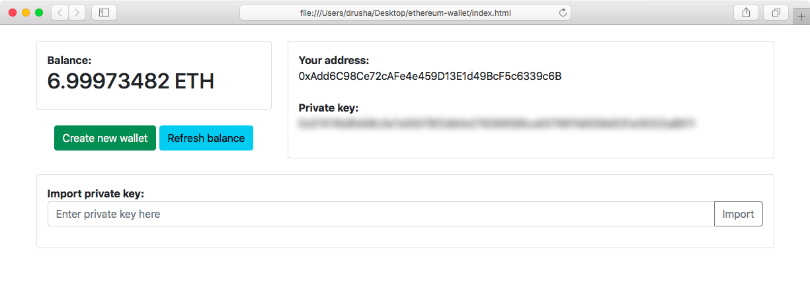

# Simple Ethereum Wallet

Simple Ethereum wallet written in plain JS using *web3.js* library and some Bootstrap 5 for style.

**DO NOT USE IT FOR PRODUCTION, ONLY FOR EDUCATIONAL PURPOSES**

  
    

## Features

* Show balance
* Generate wallet
* Store wallet data in cookies
* Import wallet from private key

## Usage

Clone this repository and change Infura API Token in *main.js* or change node URL.

That's it.